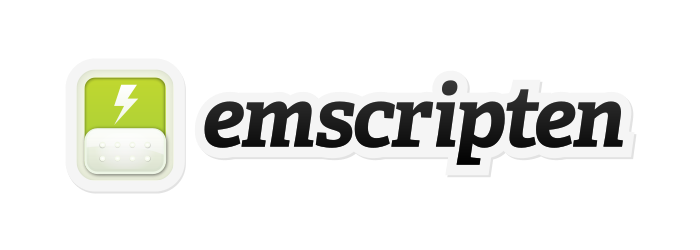

Emscripten is an [LLVM](https://en.wikipedia.org/wiki/LLVM)-to-JavaScript compiler. It takes LLVM bitcode - which can be generated
from C/C++, using `llvm-gcc` (DragonEgg) or `clang`, or any other language that can be
converted into LLVM - and compiles that into JavaScript, which can be run on the web (or
anywhere else JavaScript can run).

Links to **demos**, **tutorial**, **FAQ**, etc: <https://github.com/kripken/emscripten/wiki>

Main project page: <http://emscripten.org>

License
-------

Emscripten is available under 2 licenses, the MIT license and the
University of Illinois/NCSA Open Source License.

Both are permissive open source licenses, with little if any
practical difference between them.

The reason for offering both is that (1) the MIT license is
well-known, while (2) the University of Illinois/NCSA Open Source
License allows Emscripten's code to be integrated upstream into
LLVM, which uses that license, should the opportunity arise.

See `LICENSE` for the full content of the licenses.
