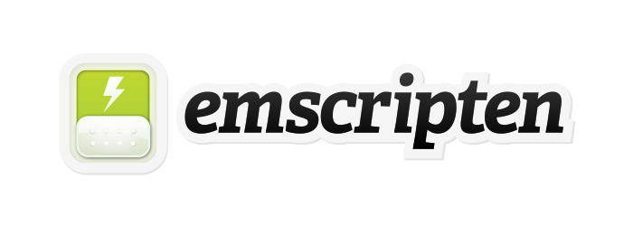

Main project page: <https://emscripten.org>

GitHub CI status: [](https://circleci.com/gh/emscripten-core/emscripten/tree/main)

Chromium builder status: [emscripten-releases](https://ci.chromium.org/p/emscripten-releases)


# Overview

Emscripten compiles C and C++ to [WebAssembly](https://webassembly.org/) using
[LLVM](https://en.wikipedia.org/wiki/LLVM) and
[Binaryen](https://github.com/WebAssembly/binaryen/). Emscripten output can run
on the Web, in Node.js, and in
[wasm runtimes](https://v8.dev/blog/emscripten-standalone-wasm#running-in-wasm-runtimes).

Emscripten provides Web support for popular portable APIs such as OpenGL and
SDL2, allowing complex graphical native applications to be ported, such as
the [Unity game engine](https://docs.unity3d.com/Manual/webgl-gettingstarted.html)
and [Google Earth](https://blog.chromium.org/2019/06/webassembly-brings-google-earth-to-more.html).
It can probably port your codebase, too!

While Emscripten mostly focuses on compiling C and C++ using
[Clang](https://clang.llvm.org/), it can be integrated with other LLVM-using
compilers (for example, Rust has Emscripten integration, with the
`wasm32-unknown-emscripten` target).


# Getting Started

For detailed instructions and tutorials, visit the [Emscripten Website](https://emscripten.org).

## Installation

There are two primary ways to install Emscripten:

1.  **Using the Emscripten SDK (emsdk) (Recommended)**
    The easiest way to get started is by using the Emscripten SDK. Follow the instructions on the [downloads page](https://emscripten.org/docs/getting_started/downloads.html) to install it.

2.  **From a Git Checkout (Manual Installation)**
    If you have cloned the repository from Git, you can install the dependencies manually and then run the bootstrap script:
    ```bash
    ./bootstrap.py
    ```
    For more details, see the [developer guide](https://emscripten.org/docs/contributing/developers_guide.html).

## Using the compiler

Run `emcc` like you would `gcc` or `clang`:

```bash
$ emcc hello.c -o hello.js
$ node hello.js
Hello, world!
```

Emscripten will compile your code into a WebAssembly module along with a
JavaScript file that can load and run it.  You can then run the resulting
JavaScript in your browser or under [Node.js](https://nodejs.org/) (or
[Deno](https://deno.com/) or [Bun](https://bun.sh/)).

Emscripten can also generate a sample HTML page that then loads the JavaScript:

```bash
$ emcc hello.c -o hello.html
```

You can then serve the generated `hello.html` using the `emrun` tool, or a
web server of your choosing.


# Contributing

For information on how to contribute to the project, see
[CONTRIBUTING.md](CONTRIBUTING.md) and the [Contributing section on the
website](https://emscripten.org/docs/contributing/contributing.html).


# License

Emscripten is available under 2 licenses, the MIT license and the
University of Illinois/NCSA Open Source License.

Both are permissive open source licenses, with little if any
practical difference between them.

The reason for offering both is that (1) the MIT license is
well-known and suitable for a compiler toolchain, while
(2) LLVM's original license, the University of Illinois/NCSA Open Source
License, was also offered to allow Emscripten's code to be integrated
upstream into LLVM. The second reason became less important after
Emscripten switched to the LLVM wasm backend, at which point there
isn't any code we expect to move back and forth between the projects;
also, LLVM relicensed to Apache 2.0 + exceptions meanwhile. In practice you
can just consider Emscripten as MIT licensed (which allows
you to do pretty much anything you want with a compiler, including
commercial and non-commercial use).

See `LICENSE` for the full content of the licenses.
