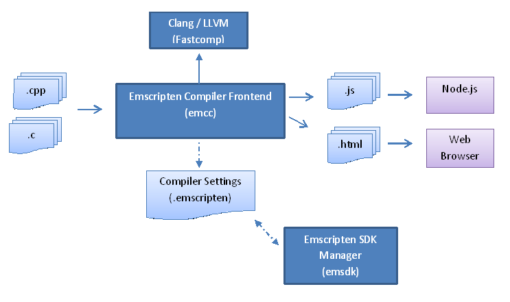

.. _about-emscripten:

================
About Emscripten
================

Emscripten is an :ref:`Open Source <emscripten-license>` LLVM to JavaScript compiler. Using Emscripten you can:

- Compile C and C++ code into JavaScript 
- Compile any other code that can be translated into LLVM bitcode into JavaScript.
- Compile the C/C++ **runtimes** of other languages into JavaScript, and then run code in those other languages in an *indirect* way (this has been done for Python and Lua)!

.. tip:: Emscripten makes native code immediately available on the Web: a platform that is standards-based, has numerous independent compatible implementations, and runs everywhere from PCs to iPads. 

	With Emscripten, C/C++ developers don't have the high cost of porting code manually to JavaScript — or having to learn JavaScript at all. Web developers also benefit, as they can use the many thousands of pre-existing native utilities and libraries in their sites.

Practically any **portable** C or C++ codebase can be compiled into JavaScript using Emscripten, ranging from high performance games that need to render graphics, play sounds, and load and process files, through to application frameworks like Qt. Emscripten has already been used to convert a `very long list <https://github.com/kripken/emscripten/wiki/Porting-Examples-and-Demos>`_ of real-world codebases to JavaScript, including large projects like *CPython*, `Poppler <https://github.com/coolwanglu/emscripten/tree/master/tests/poppler#readme>`_ and the `Bullet Physics Engine <http://kripken.github.io/ammo.js/examples/new/ammo.html>`_, as well as commercial projects like the `Unreal Engine 4 <https://blog.mozilla.org/blog/2014/03/12/mozilla-and-epic-preview-unreal-engine-4-running-in-firefox/>`_ and the `Unity <http://www.unity3d.com>`_ engine. Here are two demos using Unity:

.. figure:: DEAD-TRIGGER-2-Icon1.png
	:alt: Dead Trigger 2 Game logo
	:target: http://beta.unity3d.com/jonas/DT2/
	:align: left
	
.. raw:: html

	

For more demos, see the `list on the wiki <https://github.com/kripken/emscripten/wiki/Porting-Examples-and-Demos>`_.

Emscripten generates fast code! Its default output format is `asm.js <http://asmjs.org>`_ , a highly optimizable subset of JavaScript that can execute at close to native speed in many cases (check out the `current benchmark results <http://arewefastyet.com/#machine=11&view=breakdown&suite=asmjs-ubench>`_ or run the :ref:`benchmark tests <emscripten-benchmark-tests>` yourself). Optimized Emscripten code has also been `shown to have <http://mozakai.blogspot.com/2011/11/code-size-when-compiling-to-javascript.html>`_ a similar *effective size* to native code, when both are gzipped. 

For a better understanding of just how fast and fluid Emscripten-ported code can be, check out the `Dead Trigger 2 <http://beta.unity3d.com/jonas/DT2/>`_ and `Angrybots <http://beta.unity3d.com/jonas/AngryBots/>`_ demos above.

.. _about-emscripten-toolchain:

Emscripten Toolchain
====================

A high level view of the Emscripten toolchain is given below. The main tool is the :ref:`emccdoc`. This is a drop-in replacement for a standard compiler like *gcc*. 

*Emcc* uses :term:`Clang` to convert C/C++ files to LLVM bitcode, and :ref:`Fastcomp <LLVM-Backend>` (Emscripten's Compiler Core — an LLVM backend) to compile the bitcode to JavaScript. The output JavaScript can be executed by :term:`node.js`, or from within HTML in a browser.

The :ref:`emsdk` is used to manage multiple SDKs and tools, and to specify the particular SDK/set of tools currently being used to compile code (the :term:`Active Tool/SDK`). It can even "install" (download and build) the latest toolchain from Github! 

*Emsdk* writes the "active" configuration to the :ref:`compiler-configuration-file`. This file is used by *emcc* to get the correct current toolchain for building.

A number of other tools are not shown — for example, Java can optionally be used by *emcc* to run the :term:`closure compiler`, which can further decrease code size.

The whole toolchain is delivered in the :ref:`Emscripten SDK <sdk-download-and-install>`, and can be used on Linux, Windows or Mac OS X.

.. _about-emscripten-porting-code:

Porting code to use Emscripten
==============================

Emscripten support for **portable** C/C++ code is fairly comprehensive. Support for the C standard library, C++ standard library, C++ exceptions, etc. is very good. `SDL <https://www.libsdl.org/>`_ support is sufficient to run quite a lot of code. :ref:`OpenGL-support` support is excellent for OpenGL ES 2.0-type code, and acceptable for other types. 

There are differences between the native and :ref:`emscripten-runtime-environment`, which mean some changes usually need to be made to the native code. That said, many applications will only need to change the way they define their main loop, and also modify their :ref:`file handling <file-system-overview>` to adapt to the limitations of the browser/JavaScript. 

There are also limitations that can make some code easier to port — read :ref:`code-portability-guidelines` to determine where you may need to spend more effort.

