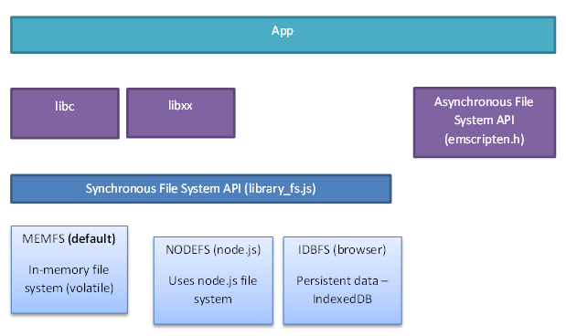

.. _file-system-overview:

====================
File System Overview
====================

The following sections provide a brief overview of the :ref:`Emscripten file system environment <file-system-runtime-environment>` and :ref:`architecture <file-system-architectural-overview>`. In addition to discussing support for standard C/C++ synchronous file APIs, it briefly discusses the :ref:`File System API <Filesystem-API>` and Emscripten's :ref:`emscripten-h-asynchronous-file-system-api`.

.. _file-system-runtime-environment:

Emscripten file system runtime environment
==========================================

Native code and "normal" JavaScript use quite different file-access paradigms. Portable native code usually calls *synchronous* file APIs in **libc** and **libcxx**, while JavaScript allows only *asynchronous* file access (except in web workers). In addition, JavaScript does not have direct access to the host file system when run inside the sandbox environment provided by a web browser.

Emscripten provides a virtual file system that simulates the local file system, so that native code using synchronous file APIs can be compiled and run with little or no change. 

:ref:`packaging-files` explains how you can use *emcc* to specify which files you need to include in the file system. For many developers, that may be all you need to do.

.. _file-system-architectural-overview:

Emscripten file system architecture
===================================

The main elements of the Emscripten File System architecture are shown below. Most native code will call the *synchronous* file APIs in **libc** and **libcxx**. These in turn call the underlying :ref:`File System API <Filesystem-API>`, which by default uses the :ref:`MEMFS <filesystem-api-memfs>` virtual file system. 

``MEMFS`` is mounted at ``/`` when the runtime is initialized. Files to be added to the MEMFS virtual file system are specified at compile time using *emcc*, as discussed in :ref:`packaging-files`. The files are loaded asynchronously by JavaScript using :ref:`Synchronous XHRs <Synchronous-Virtual-XHR-Backed-File-System-Usage>` when the page is first loaded. The compiled code is only allowed to run (and call synchronous APIs) when the asynchronous download has completed and the files are available in the virtual file system.

With ``MEMFS`` all files exist strictly in-memory, and any data written to them is lost when the page is reloaded. If persistent data is required you can mount the :ref:`IDBFS <filesystem-api-idbfs>` file system in a browser or :ref:`NODEFS <filesystem-api-nodefs>` on *node.js*. :ref:`NODEFS <filesystem-api-nodefs>` provides direct access to the local file system, but only when run inside *node.js*. You can call the :ref:`File System API <Filesystem-API>` directly from your own JavaScript to mount new file systems, and to perform other synchronous file system operations that might be required. There is more information on this topic in :ref:`filesystem-api-filesystems`.

If you need to fetch other files from the network to the file system then use :c:func:`emscripten_wget` and the other methods in the :ref:`emscripten-h-asynchronous-file-system-api`. These methods are asynchronous and the application must wait until the registered callback completes before trying to read them. 
	

